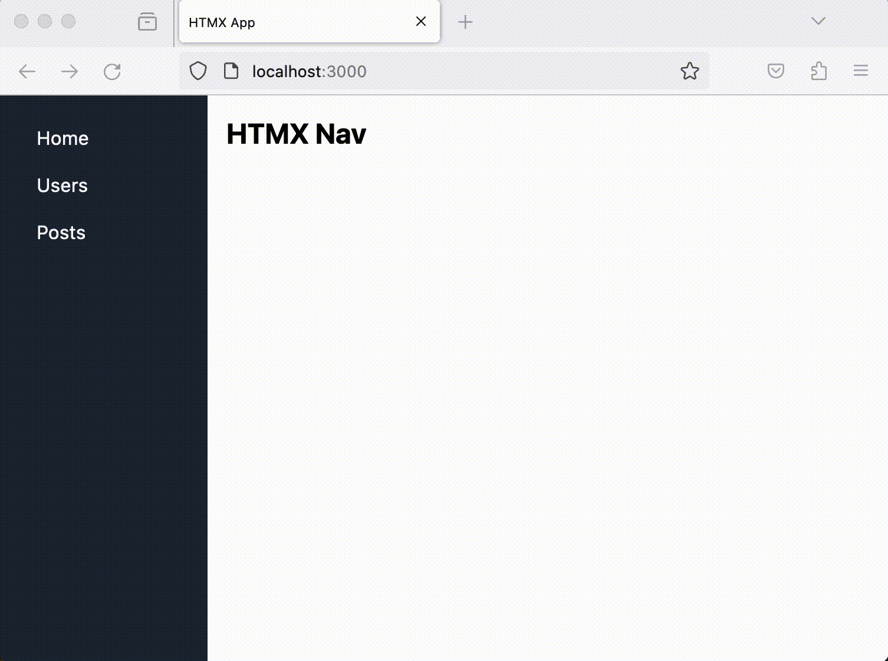
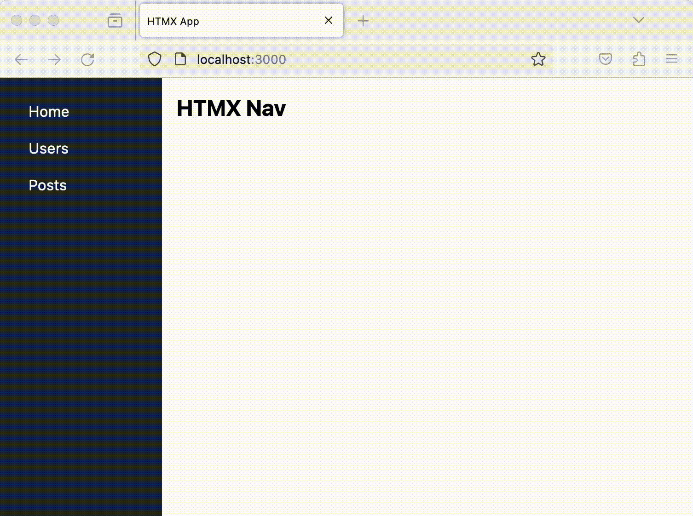

# Page Navigation with HTMX
React can often be excessive for your web application, and there are instances when utilizing only a web server alongside HTMX can produce equivalent results for creating an interactive application.

In this blog post, we will illustrate how HTMX can be used to build interactive, flicker-free page navigation:


## Server Setup
```bash
mkdir no-react-app 
cd no-react-app
npm init -y
npm install express nunjucks 

```

then we create a server file and run

```js
//File: app.js
const express = require("express")
const app = express()


const nunjucks = require('nunjucks');
nunjucks.configure("views", {
    autoescape: true,
    express: app
});


app.get("/", (req, res) => {
    res.render("pages/home.html")
})

app.get("/users", (req, res) => {
    res.render("pages/users.html")
})

app.get("/posts", (req, res) => {
    res.render("pages/posts.html")
})

app.listen(3000, () => {
    console.info(`Application running http://localhost:3000`)
})
```
We are using nunjucks as a templating engine. All templates, layouts, and partials are to be stored in the "views" directory.
Our project structure will therefore be as follows

```
app.js
views
  layouts
    main.html
  partials
    sidenav.html
  pages
    user.html
    home.html
    posts.html
```

Because we're using a template engine, let's add a layout in which all views will extend

```html
<!--File: views/layouts/main.html-->
<!DOCTYPE html>
<html lang="en">

<head>
    <meta charset="UTF-8">
    <meta name="viewport" content="width=device-width, initial-scale=1.0">
    <link rel="stylesheet"
        href="https://cdnjs.cloudflare.com/ajax/libs/tailwindcss/2.0.2/tailwind.min.css" />
    <title>HTMX App</title>
</head>

<body class="bg-gray-200">
    <div class="flex h-screen">
        <!-- Side Navigation -->
        

        <!-- Main Content Area -->
        <div class="w-full bg-white p-4" id="main">
            
        </div>

</body>

</html>
```

We have refactored a sidenav template component into partials and included this in our layout

```html
<!--File: views/partials/sidenav.html-->
<div class="w-56 bg-gray-800 text-white p-4">
    <a href="/" class="block py-2 px-4 text-white hover:bg-gray-600">Home</a>
    <a href="/users" class="block py-2 px-4 text-white hover:bg-gray-600">Users</a>
    <a href="/posts" class="block py-2 px-4 text-white hover:bg-gray-600">Posts</a>
</div>
```

and created our main pages, home.html, users.html and posts.html

```html
<!--views/pages/home.html-->



<h1 class="text-2xl font-bold mb-4">HTMX Nav</h1>

```

```html
<!--views/pages/users.html-->



<h1 class="text-2xl font-bold mb-4">Users</h1>

```

```html
<!--views/pages/posts.html-->



<h1 class="text-2xl font-bold mb-4">Posts</h1>

```

When we run the server we have navigation, but with full page reloads:



We need to fix this.
Let's add the small HTMX library and show how we can use it to help create a smoother more interactive navigation user experience

The fastest way to get going with htmx is to load it via a CDN. You can simply add this to your head tag and get going:


<script src="https://unpkg.com/htmx.org@latest" ></script>

```html
<!--File: views/layouts/main.html-->
...
    <script src="https://unpkg.com/htmx.org@latest"></script>
    <title>HTMX App</title>
</head>
...
```

We now can make a small change to the sidenav
1. Remove href attributes and replace with hx-get attributes. When a user clicks on this link, an HTTP GET request is issued.
2. Add hx-target attribute either to each anchor or one to the anchor parent div. The hx-target attribute allows you to target an element for swapping the response of the hx-get.
3. Add hx-push-url="true" to each anchor. The hx-push-url attribute allows you to push a URL into the browser location history. This creates a new history entry, allowing navigation with the browser’s back and forward buttons.

What does this do:
We are declaratively instructing the HTMX lib to make a server call when the anchor is clicked and insert the response into the div of id 'main'

```html
<div class="w-56 bg-gray-800 text-white p-4" hx-target="#main"  >
    <a hx-get="/" hx-push-url="true"  class="block py-2 px-4 text-white hover:bg-gray-600">Home</a>
    <a hx-get="/users" hx-push-url="true"  class="block py-2 px-4 text-white hover:bg-gray-600">Users</a>
    <a hx-get="/posts" hx-push-url="true"  class="block py-2 px-4 text-white hover:bg-gray-600">Posts</a>
</div>
```

We now have the following.



We solved the flicker issue and the url correctly pushes to the new url if we might want to share the navigation

We need to determine whether each incoming server request is an HTMX call or not. If it is, we must instruct the template engine to skip using the layout and simply return the HTML of that template. To achieve this, we'll need to incorporate specific middleware:

```js
//File: app.js
...
app.use((req, res, next) => {
    res.locals.useLayout = req.headers["hx-request"] !== "true";
    next();
})

...

app.listen(3000, () => {
    console.info(`Application running http://localhost:3000`)
})
```

and we need to add a conditional in the main.html layout

```html
<!--File: views/layouts/main.html-->

<!DOCTYPE html>
<html lang="en">

<head>
    <meta charset="UTF-8">
    <meta name="viewport" content="width=device-width, initial-scale=1.0">
    <link rel="stylesheet"
        href="https://cdnjs.cloudflare.com/ajax/libs/tailwindcss/2.0.2/tailwind.min.css" />
    <script src="https://unpkg.com/htmx.org@latest"></script>
    <title>HTMX App</title>
</head>

<body class="bg-gray-200">
    <div class="flex h-screen">
        <!-- Side Navigation -->
        
        <!-- Main Content Area -->
        <div class="w-full bg-white p-4" id="main">


            


        </div>
</body>

</html>

```

We've successfully accomplished a seamless and flicker-free navigation experience that allows for sharing URLs.

